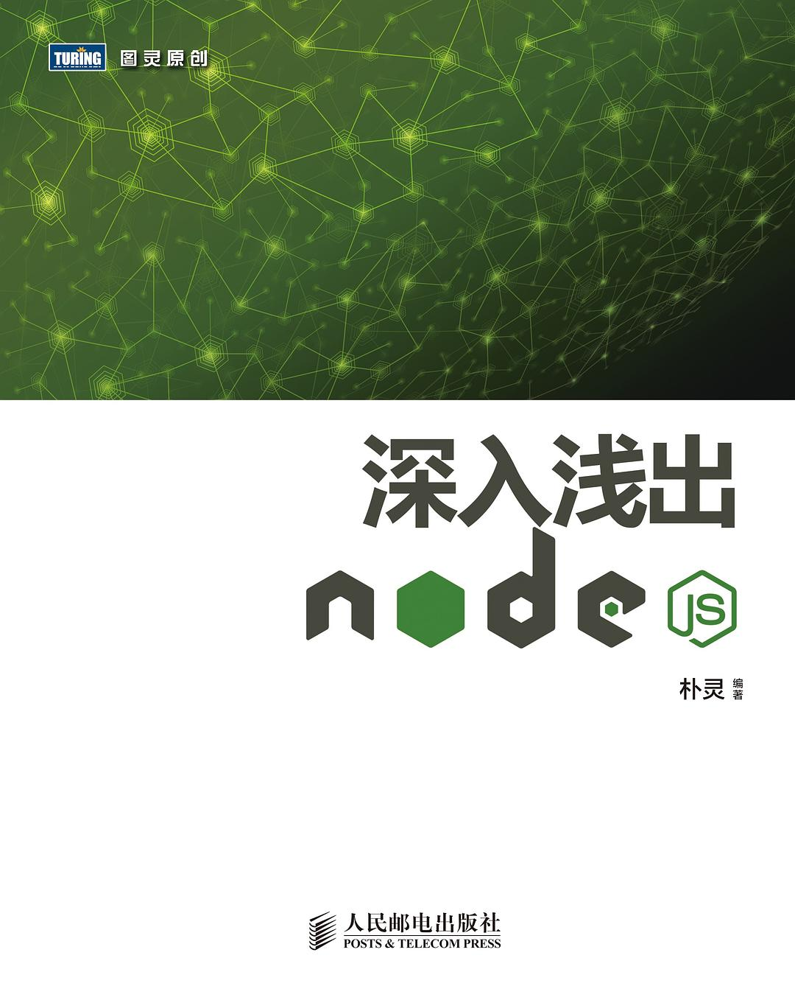

# 深入浅出Node.js

作者: 朴灵  
出版社: 人民邮电出版社  
出版年: 2013-12-1  
页数: 332  
定价: 69.00元  
装帧: 平装  
丛书: 图灵原创  
ISBN: 9787115335500

## 内容简介  
本书从不同的视角介绍了 Node 内在的特点和结构。由首章Node 介绍为索引，涉及Node 的各个方面，主要内容包含模块机制的揭示、异步I/O 实现原理的展现、异步编程的探讨、内存控制的介绍、二进制数据Buffer 的细节、Node 中的网络编程基础、Node 中的Web 开发、进程间的消息传递、Node 测试以及通过Node 构建产品需要的注意事项。最后的附录介绍了Node 的安装、调试、编码规范和NPM 仓库等事宜。

本书适合想深入了解 Node 的人员阅读。

## 作者简介
朴灵，真名田永强，文艺型码农，就职于阿里巴巴数据平台，资深工程师，Node.js布道者，写了多篇文章介绍Node.js的细节。活跃于CNode社区，是线下会议NodeParty的组织者和JSConf China（沪JS和京JS）的组织者之一。热爱开源，多个Node.js模块的作者。个人GitHub地址：[http://github.com/JacksonTia](http://github.com/JacksonTian)。叩首问路，码梦为生。